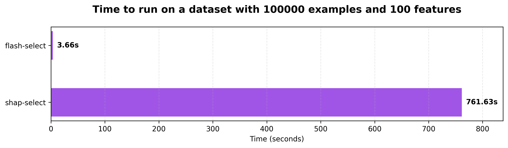

<div align="center">

# ⚡ flash-select ⚡
[](https://www.python.org/)
[](https://github.com/miguelbper/flash-select/actions/workflows/code-quality.yaml)
[](https://github.com/miguelbper/flash-select/actions/workflows/tests.yaml)
[](https://codecov.io/gh/miguelbper/flash-select)
[](LICENSE)
[](https://github.com/astral-sh/uv)
[](https://github.com/astral-sh/ruff)

*An extremely fast <ins>feature selection method</ins> / <ins>implementation of [shap-select](https://github.com/transferwise/shap-select)</ins>.*



</div>

---

## Description
flash-select is an extremely fast implementation of [shap-select](https://github.com/transferwise/shap-select), a very nice feature selection method. flash-select gives the same output as shap-select (more on this below) while being significantly faster: for a dataset with 25,600 examples and 256 features, **flash-select is ~300x faster**.

Given that flash-select has lower algorithmic complexity than shap-select, for larger datasets the speedup will be even greater.

These speedups enable feature selection for datasets with thousands of features. The package is tiny, thoroughly tested, and has few dependencies (these are numpy, pandas, scipy, and shap).

flash-select works for regression problems on tabular datasets.

## Installation
```bash
pip install flash-select
```

## Usage
```python
from flash_select import flash_select
import xgboost as xgb

# Train a model
model = xgb.XGBRegressor()
model.fit(X_train, y_train)

# Perform feature selection
selected_features_df = flash_select(
    model,
    X_val,
    y_val,
    features=feature_names,
    threshold=0.05
)

print(selected_features_df)
```

## Running the Benchmark
```bash
# Clone the project
git clone git@github.com:miguelbper/flash-select.git

# Install uv if you don't have it yet (from https://docs.astral.sh/uv/)
curl -LsSf https://astral.sh/uv/install.sh | sh

# Move to the project directory and install (dev) dependencies
uv sync

# Run benchmark
bash benchmark/run.sh
```

**Benchmark results:**
| Samples (m) | Features (n) | flash-select (s) | shap-select (s) | Speedup | Selected Features | Selected same set of features?|
|-------------|--------------|------------------|-----------------|---------|-------------------|-------------------------------|
| 3200        | 32           | 0.19             | 0.87            | 4.6x    | 15/32             | Yes                           |
| 6400        | 64           | 0.65             | 7.05            | 10.9x   | 32/64             | Yes                           |
| 12800       | 128          | 2.06             | 127.86          | 62.0x   | 65/128            | Yes                           |
| 25600       | 256          | 7.78             | 2476.31         | 318.3x  | 129/256           | Yes                           |

**System Specifications:**
- **OS**: Ubuntu 24.04.2 LTS on Windows 10 x86_64 (WSL2)
- **Kernel**: Linux 6.6.87.2-microsoft-standard-WSL2
- **CPU**: AMD Ryzen 9 5900X (24 threads) @ 3.699GHz
- **Memory**: 96.6 GB RAM
- **Environment**: WSL2 (Windows Subsystem for Linux)

## How is it so fast?
The original implementation of shap-select iteratively performs a linear regression on the dataset (Shapley values, target), where at each iteration we delete one column of the Shapley values matrix. With no regularization, the linear regression coefficients $\beta$ are given by:

$$
    \begin{align}
    A &= S^T S \\
    b &= S^T y \\
    \beta &= A^{-1} b.
    \end{align}
$$

We can save on computation by doing linear regression explicitly (instead of calling an external library) and updating (instead of recomputing from scratch) the matrix $A^{-1}$. The same logic is used for other arrays as well.

Note that shap-select uses a small L1 regularization of $\alpha = 10^{-6}$.
- It is possible to show mathematically that flash-select gives exactly the same results as shap-select with $\alpha = 0$ (this is also verified in the unit tests)
- Numerical experiments show that flash-select gives the same set of selected features as shap-select with $\alpha = 10^{-6}$

For these reasons, $\alpha = 0$ in flash-select, which enables speedups of several orders of magnitude.

## License
This project is licensed under the MIT License - see the [LICENSE](LICENSE) file for details.

## Acknowledgments
[shap-select](https://github.com/transferwise/shap-select) and its authors.
